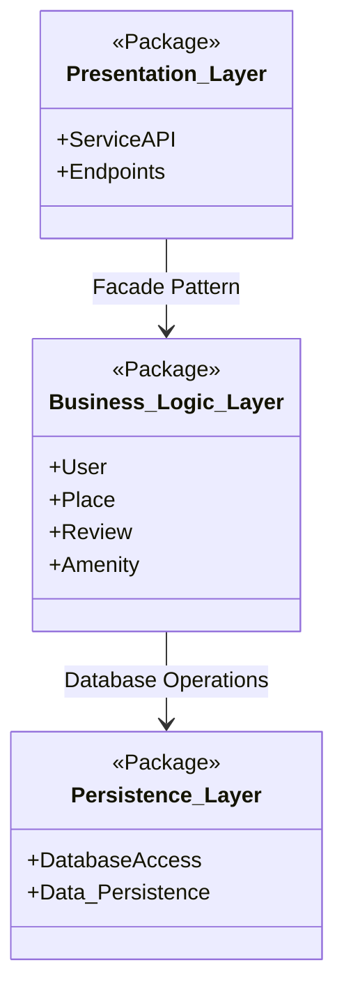
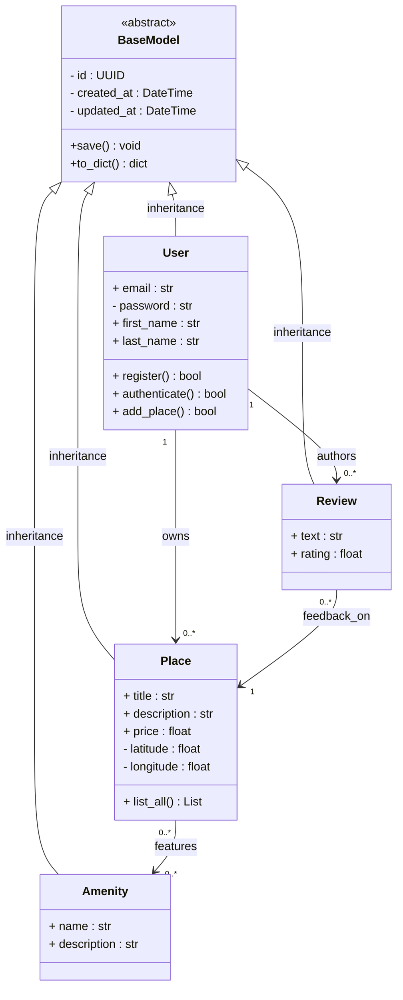
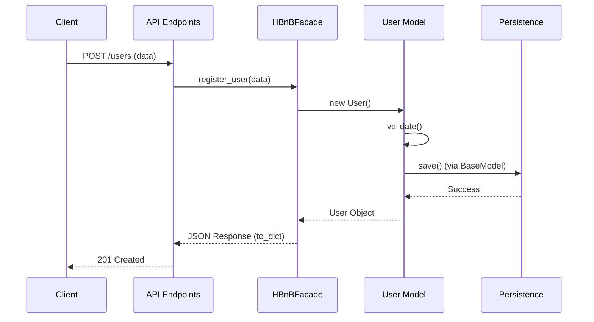

# holbertonschool-hbnb

# HBnB Project: Technical Documentation

## *The Strategic Blueprint for a Scalable Booking System*

### 1. Introduction

**Purpose and Scope**
This technical document serves as a comprehensive guide for the implementation phase of the HBnB application. Its objective is to define the system's architecture, data structures, and interaction logic to ensure consistency, scalability, and technical excellence [cite: 2025-12-30, 2026-02-05].

**Project Overview**
HBnB is a high-end booking platform designed to facilitate interactions between hosts and travelers. This version focuses on a diverse lodging ecosystem, including **Ryokans**, **Business Hotels**, and specialized accommodations [cite: 2026-01-22, 2026-02-12]. This document provides a detailed overview of the system’s design, transitioning from high-level packages to specific API call sequences.

---

### 2. High-Level Architecture (Task 0)

The system is built upon a **Three-Layer Architecture** to ensure a strict separation of concerns, facilitating independent development and testing of each component.

#### **Package Diagram**

**Explanatory Notes:**

* **Design Decision**: We utilize the **Facade Pattern** as the unique gateway between the Presentation and Business Logic layers.
* **Rationale**: This decouples the API from the internal complexities of the models, allowing for changes in business rules without impacting the end-user interface.
* **Layers**:
* **Presentation**: Handles HTTP requests/responses and user input.
* **Business Logic**: Orchestrates core operations and manages system entities [cite: 2026-02-07].
* **Persistence**: Dedicated solely to long-term data storage and integrity.

---

### 3. Business Logic Layer (Task 1)

The core of HBnB centers on a reusable `BaseModel` and specialized entities, ensuring a clean and professional code structure [cite: 2025-12-30, 2026-02-05].

#### **Detailed Class Diagram**

---

### 4. API Interaction Flow (Task 2)

The dynamics of the system are captured through sequence diagrams, illustrating the data flow during critical operations.

#### **Sample Sequence: User Registration**

---

### 5. Final Design Rationale

* **Data Persistence**: All entities inherit from `BaseModel` to ensure a standardized persistence protocol, using UUIDs for global uniqueness [cite: 2025-12-30].
* **Security by Design**: Sensitive attributes like passwords are kept private, and validation occurs at the Business Logic layer before any database write.
* **Long-Term Vision**: This architecture avoids "short-termism" by providing a modular framework capable of supporting future expansions, such as the **PARENT(HÈSES)** ecosystem or high-tech integration via **Glassier** [cite: 2025-12-20, 2025-12-25, 2026-01-31].

---

### 6. Technical Requirements for Implementation

To maintain the standards of excellence required for this project [cite: 2026-02-05]:

* **Environment**: Python 3.x with a dedicated virtual environment [cite: 2025-12-29].
* **Core Libraries**: `Flask` for the API, `UUID` for unique identification, and `datetime` for timestamps.
* **Testing**: Mandatory unit testing with `pytest` for every model and API endpoint.
