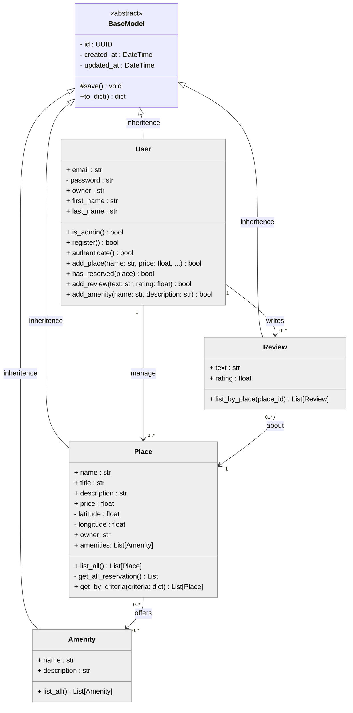

## HBnB Evolution - Task 1: Business Logic Layer Diagram

### Overview

This task focuses on the design of the **Business Logic Layer** of the HBnB application.  
The objective is to clearly model the core entities and their interactions while enforcing strong domain rules.  
By structuring this layer properly, we ensure better maintainability, scalability, and consistency of the application's behavior.

### 1. Business Logic Architecture

The following diagram represents the internal structure of the Business Logic Layer.  
It highlights the main domain models, their attributes, behaviors, and relationships, providing a clear view of how business rules are organized independently from the presentation and persistence layers.

## 2. Business Logic Layer Description

**Business Logic Layer (Models):**  
This layer contains the core domain entities of the HBnB application. It defines the main objects of the system such as `User`, `Place`, `Review`, and `Amenity`, along with their attributes, relationships, and responsibilities.  
It encapsulates the essential business rules that govern how data is created, modified, validated, and linked together.

**BaseModel:**  
Acts as a shared abstract foundation for all business entities. It standardizes common attributes such as identifiers and timestamps while providing reusable utility methods.

----------

## 3. Relationships and Responsibilities

The diagram highlights how the main entities interact:

-   A **User** can manage multiple places and write reviews.
    
-   A **Place** can include multiple amenities and receive reviews from users.
    
-   **Amenities** describe services or features associated with places.
    
-   **Reviews** capture feedback and ratings linked to specific places.
    

These relationships ensure a coherent domain model that reflects the functional requirements of the HBnB platform.

----------

## 4. Architectural Role

The Business Logic Layer serves as the central decision-making layer of the application:

-   It isolates domain rules from presentation and persistence concerns.
    
-   It ensures data consistency and validation before storage or exposure via APIs.
    
-   It promotes maintainability by clearly separating responsibilities between layers.
    

This structured model facilitates scalability, easier testing, and future feature evolution.
