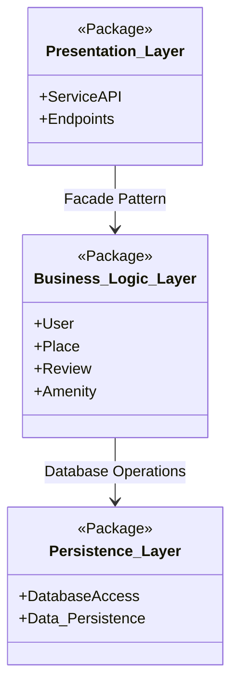

# HBnB Evolution - Task 0: High-Level Package Diagram

## Overview

This project establishes a robust three-layer architecture for the HBnB application. By prioritizing a clear Separation of Concerns, we ensure long-term scalability and maintainability, avoiding "short-termism" in our technical design.

## 1. High-Level Architecture

The following diagram illustrates the structural organization of the system and the communication pathways between layers.

## 2. Layer Descriptions

-   **Presentation Layer (Services, API)**: The user-facing interface that handles HTTP requests and returns structured responses.
    
-   **Business Logic Layer (Models)**: The core engine containing the primary entities (`User`, `Place`, `Review`, `Amenity`) and the fundamental rules of the system.
    
-   **Persistence Layer**: Responsible for **Data Persistence**, managing all database interactions and ensuring data integrity across sessions.

----------

## 3. Communication Strategy: The Facade Pattern

To maintain a high standard of architectural excellence, the  **Facade Pattern**  is implemented between the Presentation and Business Logic layers.

-   **Purpose**: Provides a unified, simplified interface to the complex internal models.
    
-   **Strategic Value**: Decouples the API from the business logic, allowing each layer to evolve independently without breaking the system.
