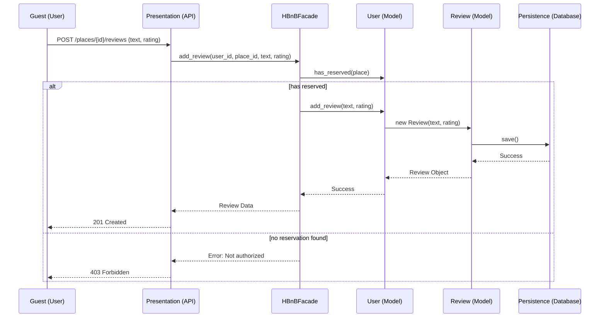

# HBnB Evolution - Task 2: Sequence Diagram for API CAlls

**User Registration**: This flow demonstrates the interaction between the **Presentation Layer** and the **User model** via the **Facade**. The `register()` method handles the logic, and the `save()` method from `BaseModel` ensures the data is committed to the **Persistence Layer**.
```mermaid
sequenceDiagram
        participant U as Client/User
        participant P as Presentation (API)
        participant F as HBnBFacade
        participant B as User (Business Logic)
        participant D as Persistence (Database)
    
        U->>P: POST /users (user_data)
        P->>F: register_user(user_data)
        F->>B: new User(user_data)
        F->>B: register()
        alt registration successful
            B->>B: validate_email()
            B->>D: save() (via BaseModel)
            D-->>B: Success
            B-->>F: User Object
            F-->>P: User Data (to_dict)
            P-->>U: 201 Created
        else email already exists
            B-->>F: Error: User exists
            F-->>P: Error Response
            P-->>U: 400 Bad Request
        end
   ```
**Place Creation**: This diagram highlights the relationship defined in Task 1 where a `User` manages multiple `Places`. The Facade coordinates the creation, ensuring the host is authenticated before the `Place` is validated and persisted.
```mermaid
sequenceDiagram
    participant U as Host (User)
    participant P as Presentation (API)
    participant F as HBnBFacade
    participant B as User (Model)
    participant PL as Place (Model)
    participant D as Persistence (Database)

    U->>P: POST /places (place_data)
    P->>F: create_place(place_data)
    F->>B: authenticate()
    F->>B: add_place(name, price, ...)
    B->>PL: new Place(data)
    PL->>PL: validate_coordinates()
    PL->>D: save() (via BaseModel)
    D-->>PL: Success
    PL-->>B: Place Object
    B-->>F: Confirmation
    F-->>P: Place Data (to_dict)
    P-->>U: 201 Created
```
**Review Submission**: A complex interaction where the system checks the business rule `has_reserved()` before allowing a `User` to write a `Review` about a `Place`. This ensures high-quality, authentic data in your system.

**Data Consistency**: All entities use the `to_dict()` method (from `BaseModel`) to return clean JSON data to the **Presentation Layer**, maintaining a strict separation between internal objects and API responses.
