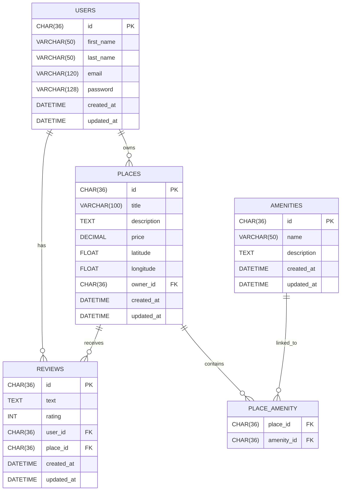

```mermaid
erDiagram

    USERS {
        CHAR(36) id PK
        VARCHAR(50) first_name
        VARCHAR(50) last_name
        VARCHAR(120) email
        VARCHAR(128) password
        DATETIME created_at
        DATETIME updated_at
    }

    PLACES {
        CHAR(36) id PK
        VARCHAR(100) title
        TEXT description
        DECIMAL price
        FLOAT latitude
        FLOAT longitude
        CHAR(36) owner_id FK
        DATETIME created_at
        DATETIME updated_at
    }

    AMENITIES {
        CHAR(36) id PK
        VARCHAR(50) name
        TEXT description
        DATETIME created_at
        DATETIME updated_at
    }

    REVIEWS {
        CHAR(36) id PK
        TEXT text
        INT rating
        CHAR(36) user_id FK
        CHAR(36) place_id FK
        DATETIME created_at
        DATETIME updated_at
    }

    PLACE_AMENITY {
        CHAR(36) place_id FK
        CHAR(36) amenity_id FK
    }

    USERS ||--o{ REVIEWS : has
    USERS ||--o{ PLACES : owns
    PLACES ||--o{ REVIEWS : receives
    PLACES ||--o{ PLACE_AMENITY : contains
    AMENITIES ||--o{ PLACE_AMENITY : linked_to
```
