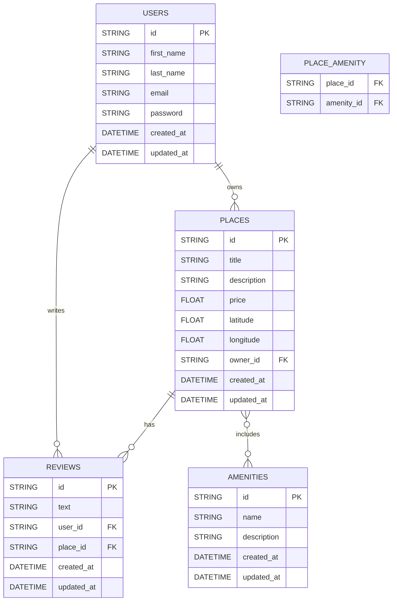

```mermaid
erDiagram
    USERS {
        STRING id PK
        STRING first_name
        STRING last_name
        STRING email
        STRING password
        DATETIME created_at
        DATETIME updated_at
    }

    PLACES {
        STRING id PK
        STRING title
        STRING description
        FLOAT price
        FLOAT latitude
        FLOAT longitude
        STRING owner_id FK
        DATETIME created_at
        DATETIME updated_at
    }

    AMENITIES {
        STRING id PK
        STRING name
        STRING description
        DATETIME created_at
        DATETIME updated_at
    }

    REVIEWS {
        STRING id PK
        STRING text
        STRING user_id FK
        STRING place_id FK
        DATETIME created_at
        DATETIME updated_at
    }

    PLACE_AMENITY {
        STRING place_id FK
        STRING amenity_id FK
    }

    USERS ||--o{ PLACES : owns
    USERS ||--o{ REVIEWS : writes
    PLACES ||--o{ REVIEWS : has
    PLACES }o--o{ AMENITIES : includes
```
